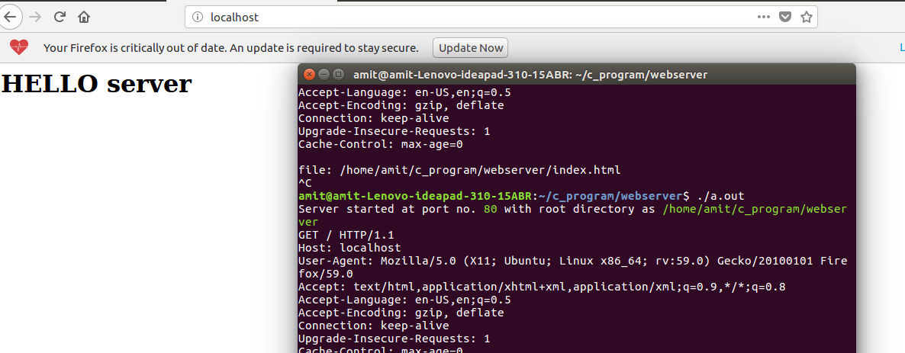

# C_based-webserver
A simple webserver that accpets the connection at specified port (default port is 80) and returns the index.html file on root and downloads other requested files.

Instructions to compile the code:

    1)compile and create the excecutable file: $ gcc webserver.c 
  
    2)give executable permission to a.out: $ sudo chmod +x a.out
  
After excuting the code open browser localhost:80 you should be abale to see index.html open on your browser. 
 

Requsting any other files in the directry, will be downloaded. 

If you have any problem starting your server on default port 80, try changing the ownership of a.out file. 

        $ sudo chown root a.out
        

# References

[Geeks for Geeks](https://www.geeksforgeeks.org/socket-programming-cc/) 
[Abhijeet's Blog](https://blog.abhi.host/blog/) 
[Man7.org](http://man7.org/linux/man-pages/)

  
